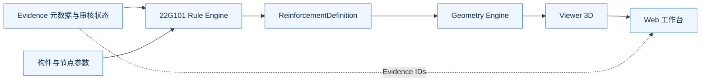
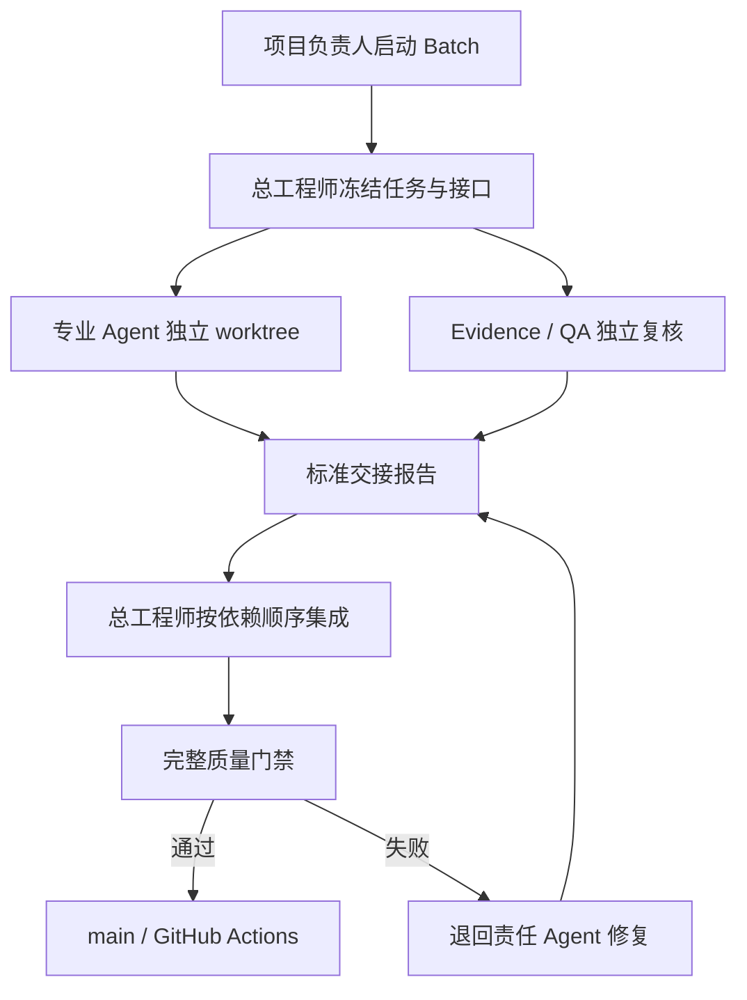

# 项目架构图

## 运行时数据流

依赖只沿箭头方向流动。Evidence 记录来源与审核状态；Rule Engine 解释规则；Geometry Engine 生成纯几何；Viewer 负责显示；Web 负责交互编排。

## 仓库地图

| 路径 | 职责 | 主要消费者 |
| --- | --- | --- |
| `packages/schemas/` | 跨层 TypeScript 数据契约 | Rule、Geometry、Web、QA |
| `packages/g101-rule-engine/` | 参数校验、规则匹配和钢筋定义输出 | Web、QA |
| `packages/geometry-engine/` | 钢筋中心线直线/圆弧几何 | Viewer、QA |
| `packages/viewer-3d/` | Three.js 几何适配和对象身份 | Web、QA |
| `apps/web/` | 参数输入、状态展示和 3D 工作台 | 最终用户 |
| `data/22g101/` | 可公开的结构化规则元数据 | Rule、Evidence、QA |
| `tests/` | 跨包、规则覆盖与回归测试 | CI、总工程师 |
| `docs/` | 决策、边界、来源与验收说明 | 所有参与者 |
| `agents/` | Agent 角色入口和历史交接 | 所有 Agent |

## 协作控制流

总工程师协调集成，但不能替代独立 Evidence 审核。任何 Agent 都不能自行宣布未启动的 Batch 已开始。
